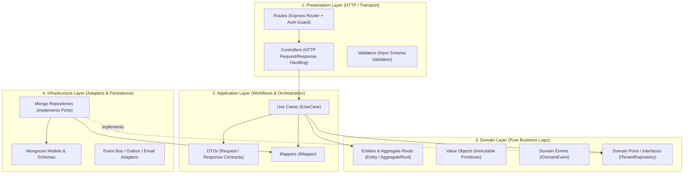
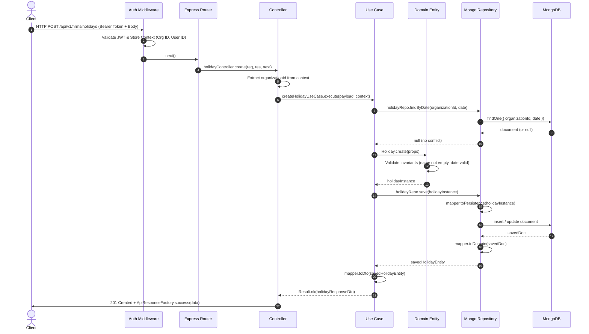

# Apex Framework — Domain-Driven Design (DDD) Module Guide

This document is the official engineering guide and reference for the **Domain-Driven Design (DDD) & Clean Architecture** structure implemented in `apex-framework`. Use this guide whenever you are exploring existing modules, developing new features, or adding entirely new business domains.

---

## 1. Architectural Principles & Dependency Direction

The framework follows strict **Clean Architecture (Hexagonal / Ports & Adapters)** principles. Each domain module in `src/modules/*` is organized as an isolated vertical slice.

### The Dependency Inversion Rule
Dependencies point **inward** toward the core domain logic:

$$\text{Presentation Layer} \longrightarrow \text{Application Layer} \longrightarrow \text{Domain Layer} \longleftarrow \text{Infrastructure Layer}$$



### Absolute Layer Rules
1. **Domain Layer (`src/modules/<module>/domain/`)**:
   - Must be written in 100% pure TypeScript.
   - **Zero external dependencies**: Never import `express`, `mongoose`, `mongodb`, `nodemailer`, or framework libraries.
   - Holds business rules, validation invariants, aggregate roots, and repository ports (interfaces).
2. **Application Layer (`src/modules/<module>/application/`)**:
   - Orchestrates use cases and business transactions.
   - Converts data between Domain entities and DTOs using Mappers.
   - Never imports Express `req` / `res` or Mongoose models directly.
3. **Infrastructure Layer (`src/modules/<module>/infrastructure/`)**:
   - Implements domain repository interfaces (e.g., `MongoHolidayRepository` implementing `IHolidayRepository`).
   - Mongoose schemas and database models are strictly confined here.
   - Maps database documents to/from pure domain entities.
4. **Presentation Layer (`src/modules/<module>/presentation/`)**:
   - Thin HTTP controllers that extract request parameters, obtain tenant context from `AsyncLocalStorage`, call use cases, and wrap results into standard JSON envelopes (`ApiResponseFactory`).

---

## 2. Standard Module Directory Structure

Every module in `src/modules/<module-name>/` follows this exact folder layout:

```text
src/modules/<module_name>/
├── domain/                         # Pure Business Logic Layer
│   ├── entities/                   # Domain Entities & Aggregate Roots
│   │   ├── Holiday.ts
│   │   └── Employee.ts
│   ├── value-objects/              # Immutable Value Objects
│   │   └── EmployeeCode.ts
│   ├── events/                     # Domain Events
│   │   └── EmployeeCreatedEvent.ts
│   ├── ports/                      # Repository and Service Interfaces
│   │   └── IHolidayRepository.ts
│   └── index.ts
│
├── application/                    # Application / Orchestration Layer
│   ├── use-cases/                  # Single-purpose Use Case classes
│   │   ├── CreateHolidayUseCase.ts
│   │   └── ListHolidaysUseCase.ts
│   ├── dto/                        # Request / Response DTOs
│   │   └── HolidayDto.ts
│   ├── mappers/                    # Entity <-> Persistence <-> DTO Mappers
│   │   └── HolidayMapper.ts
│   └── index.ts
│
├── infrastructure/                 # Technical / Adapter Layer
│   ├── persistence/                # Database Schemas & Documents
│   │   └── holiday.model.ts
│   ├── repositories/               # Repository Port Implementations
│   │   ├── MongoHolidayRepository.ts
│   │   └── InMemoryHolidayRepository.ts (for testing)
│   └── index.ts
│
├── presentation/                   # API / Transport Layer
│   ├── controllers/                # Express Controllers
│   │   ├── holiday.controller.ts
│   │   └── context.helper.ts       # Tenant context extractor
│   ├── routes/                     # Express Routers
│   │   └── hrms.routes.ts
│   ├── validators/                 # Payload validation schemas
│   └── index.ts
│
└── index.ts                        # Module Factory & Public Exports
```

---

## 3. End-to-End Request & Data Flow

Here is the step-by-step lifecycle of an API request:



---

## 4. Multi-Tenancy & Security Context

Apex Infinity is a **multi-tenant architecture**. Every piece of data belongs to an `organizationId`.

### How Context is Passed:
1. **Request Context Middleware**: When a request comes in, `requestContextMiddleware` establishes an `AsyncLocalStorage` context containing:
   - `organizationId`: Authenticated tenant ID.
   - `userId`: Authenticated user ID.
   - `roles` & `permissions`: Role and permission arrays.
   - `correlationId` & `requestId`: Tracing identifiers.
2. **Controller Context Helper**: In each module's `context.helper.ts`:
   ```typescript
   export function getHrmsContext(): HrmsRequestContext {
     const ctx = RequestContextHolder.get();
     return {
       organizationId: ctx?.organizationId || 'default',
       userId: ctx?.userId || 'system',
       roles: ctx?.roles || [],
       permissions: ctx?.permissions || [],
       ...
     };
   }
   ```
3. **Repository Multi-Tenant Guard**: Repository ports extend `ITenantRepository<TEntity, TId>`, requiring `organizationId` in all queries to ensure data isolation.

---

## 5. Step-by-Step Guide: Adding a New Feature or Module

When creating a new entity or building a new module, follow this exact 6-step flow:

### Step 1: Create Domain Entity (`domain/entities/`)
Extend `Entity<TId>` or `AggregateRoot<TId>`. Keep attributes private and validate invariants in factory methods.

```typescript
// src/modules/example/domain/entities/Sample.ts
import { Entity } from '../../../../core/domain/Entity';
import { DomainError } from '../../../../shared/errors';
import { v4 as uuidv4 } from 'uuid';

export interface SampleProps {
  organizationId: string;
  name: string;
  isActive: boolean;
  createdAt: Date;
  updatedAt: Date;
}

export class Sample extends Entity<string> {
  private _organizationId: string;
  private _name: string;
  private _isActive: boolean;
  private readonly _createdAt: Date;
  private _updatedAt: Date;

  private constructor(id: string, props: SampleProps) {
    super(id);
    this._organizationId = props.organizationId;
    this._name = props.name;
    this._isActive = props.isActive;
    this._createdAt = props.createdAt;
    this._updatedAt = props.updatedAt;
  }

  public static create(params: { organizationId: string; name: string }): Sample {
    if (!params.organizationId) throw new DomainError('Organization ID is required.');
    if (!params.name || !params.name.trim()) throw new DomainError('Name cannot be empty.');

    const now = new Date();
    return new Sample(uuidv4(), {
      organizationId: params.organizationId,
      name: params.name.trim(),
      isActive: true,
      createdAt: now,
      updatedAt: now,
    });
  }

  public static reconstitute(id: string, props: SampleProps): Sample {
    return new Sample(id, props);
  }

  public get organizationId(): string { return this._organizationId; }
  public get name(): string { return this._name; }
  public get isActive(): boolean { return this._isActive; }
  public get createdAt(): Date { return this._createdAt; }
  public get updatedAt(): Date { return this._updatedAt; }
}
```

### Step 2: Define Domain Repository Port (`domain/ports/`)
Declare the repository contract interface.

```typescript
// src/modules/example/domain/ports/ISampleRepository.ts
import { ITenantRepository } from '../../../../core/domain/IRepository';
import { Sample } from '../entities/Sample';

export interface ISampleRepository extends ITenantRepository<Sample, string> {
  findByName(organizationId: string, name: string): Promise<Sample | null>;
}
```

### Step 3: Create DTOs & Mappers (`application/`)
Create request/response contracts and bidirectional mappers.

```typescript
// 1. src/modules/example/application/dto/SampleDto.ts
export interface CreateSampleDto {
  name: string;
}

export interface SampleResponseDto {
  id: string;
  organizationId: string;
  name: string;
  isActive: boolean;
  createdAt: string;
  updatedAt: string;
}

// 2. src/modules/example/application/mappers/SampleMapper.ts
import { IMapper } from '../../../../core/application/IMapper';
import { Sample, SampleProps } from '../../domain/entities/Sample';
import { SampleResponseDto } from '../dto/SampleDto';

export class SampleMapper implements IMapper<Sample, any, SampleResponseDto> {
  public toDomain(raw: any): Sample {
    const props: SampleProps = {
      organizationId: raw.organizationId,
      name: raw.name,
      isActive: raw.isActive ?? true,
      createdAt: new Date(raw.createdAt),
      updatedAt: new Date(raw.updatedAt),
    };
    return Sample.reconstitute(raw._id || raw.id, props);
  }

  public toPersistence(domain: Sample): Record<string, unknown> {
    return {
      _id: domain.id,
      organizationId: domain.organizationId,
      name: domain.name,
      isActive: domain.isActive,
      createdAt: domain.createdAt,
      updatedAt: domain.updatedAt,
    };
  }

  public toDto(domain: Sample): SampleResponseDto {
    return {
      id: domain.id,
      organizationId: domain.organizationId,
      name: domain.name,
      isActive: domain.isActive,
      createdAt: domain.createdAt.toISOString(),
      updatedAt: domain.updatedAt.toISOString(),
    };
  }
}
```

### Step 4: Implement Use Cases (`application/use-cases/`)
```typescript
// src/modules/example/application/use-cases/CreateSampleUseCase.ts
import { IUseCase, IApplicationContext } from '../../../../core/application/IUseCase';
import { Result } from '../../../../shared/result';
import { ValidationError, ConflictError } from '../../../../shared/errors';
import { ISampleRepository } from '../../domain/ports/ISampleRepository';
import { SampleMapper } from '../mappers/SampleMapper';
import { Sample } from '../../domain/entities/Sample';
import { CreateSampleDto, SampleResponseDto } from '../dto/SampleDto';

export class CreateSampleUseCase implements IUseCase<CreateSampleDto, SampleResponseDto> {
  constructor(
    private readonly repo: ISampleRepository,
    private readonly mapper: SampleMapper
  ) {}

  public async execute(
    input: CreateSampleDto,
    context?: IApplicationContext
  ): Promise<Result<SampleResponseDto>> {
    const organizationId = context?.organizationId;
    if (!organizationId) {
      return Result.fail(new ValidationError('Organization context is required.'));
    }

    const existing = await this.repo.findByName(organizationId, input.name);
    if (existing) {
      return Result.fail(new ConflictError(`Sample with name '${input.name}' already exists.`));
    }

    const entity = Sample.create({ organizationId, name: input.name });
    const saved = await this.repo.save(entity);
    return Result.ok(this.mapper.toDto(saved));
  }
}
```

### Step 5: Implement Infrastructure Persistence & Repositories (`infrastructure/`)
```typescript
// 1. src/modules/example/infrastructure/persistence/sample.model.ts
import { Schema, Document, Connection, Model } from 'mongoose';

export interface SampleDocument extends Document<string> {
  _id: string;
  organizationId: string;
  name: string;
  isActive: boolean;
  createdAt: Date;
  updatedAt: Date;
}

const sampleSchema = new Schema<SampleDocument>(
  {
    _id: { type: String, required: true },
    organizationId: { type: String, required: true, index: true },
    name: { type: String, required: true, trim: true },
    isActive: { type: Boolean, default: true, index: true },
  },
  { timestamps: true, _id: false, versionKey: false }
);

sampleSchema.index({ organizationId: 1, name: 1 });

export function getSampleModel(connection: Connection): Model<SampleDocument> {
  return connection.models['Sample'] || connection.model<SampleDocument>('Sample', sampleSchema);
}

// 2. src/modules/example/infrastructure/repositories/MongoSampleRepository.ts
import { Model } from 'mongoose';
import { MongoBaseRepository } from '../../../../infrastructure/database/MongoBaseRepository';
import { ISampleRepository } from '../../domain/ports/ISampleRepository';
import { Sample } from '../../domain/entities/Sample';
import { SampleDocument } from '../persistence/sample.model';
import { SampleMapper } from '../../application/mappers/SampleMapper';

export class MongoSampleRepository
  extends MongoBaseRepository<Sample, SampleDocument>
  implements ISampleRepository
{
  constructor(model: Model<SampleDocument>, mapper: SampleMapper) {
    super(model, mapper, ['createdAt', 'updatedAt', 'name']);
  }

  public async findByName(organizationId: string, name: string): Promise<Sample | null> {
    const doc = await this.model.findOne({ organizationId, name }).exec();
    return doc ? this.mapper.toDomain(doc) : null;
  }
}
```

### Step 6: Implement Controllers & Routes (`presentation/`)
```typescript
// 1. src/modules/example/presentation/controllers/sample.controller.ts
import { Request, Response, NextFunction } from 'express';
import { ApiResponseFactory } from '../../../../shared/contracts';
import { CreateSampleUseCase } from '../../application/use-cases/CreateSampleUseCase';
import { getHrmsContext } from './context.helper';

export class SampleController {
  constructor(private readonly createUseCase: CreateSampleUseCase) {}

  public create = async (req: Request, res: Response, next: NextFunction): Promise<void> => {
    try {
      const context = getHrmsContext();
      const result = await this.createUseCase.execute(req.body, context);
      if (result.isFailure) throw result.getError();
      res.status(201).json(ApiResponseFactory.success(result.getValue()));
    } catch (err) {
      next(err);
    }
  };
}

// 2. src/modules/example/presentation/routes/example.routes.ts
import { Router } from 'express';
import { SampleController } from '../controllers/sample.controller';
import { ITokenService } from '../../../../infrastructure/security/ITokenService';
import { createAuthMiddleware } from '../../../../middleware/auth.middleware';

export function createExampleRoutes(
  controller: SampleController,
  tokenService: ITokenService
): Router {
  const router = Router();
  const authGuard = createAuthMiddleware(tokenService);

  router.post('/', authGuard, controller.create);
  return router;
}
```

---

## 6. Module Wiring & Global Composition Root

Once all layers are written, assemble them in:

1. **Module Factory (`src/modules/<module>/index.ts`)**:
   ```typescript
   export function createExampleModule(deps: ExampleModuleDependencies): ExampleModule {
     const mapper = new SampleMapper();
     const repo = new MongoSampleRepository(getSampleModel(deps.connection), mapper);
     const createUseCase = new CreateSampleUseCase(repo, mapper);
     const controller = new SampleController(createUseCase);
     const routes = createExampleRoutes(controller, deps.tokenService);

     return { repo, createUseCase, controller, routes };
   }
   ```
2. **Global Composition Root (`src/app/composition/composition-root.ts`)**:
   - Call `createExampleModule({ ... })` and attach it to `ApplicationContainer`.
3. **Application Router (`src/app/app.ts`)**:
   - Mount routes: `apiRouter.use('/example', container.modules.example.routes);`.

---

## 7. Quick Checklist Before Submitting Code

- [ ] Does domain entity validate inputs and protect state with private fields?
- [ ] Are all database operations scoped with `organizationId`?
- [ ] Is `domain/` and `application/` completely free of Mongoose / Express imports?
- [ ] Are DTOs used for all use-case inputs and outputs instead of raw database documents?
- [ ] Are use-case results returned as `Result<T>` or thrown as structured domain errors?
- [ ] Are responses formatted using `ApiResponseFactory.success` / `ApiResponseFactory.error`?
- [ ] Are components connected via constructor injection in the module factory?
